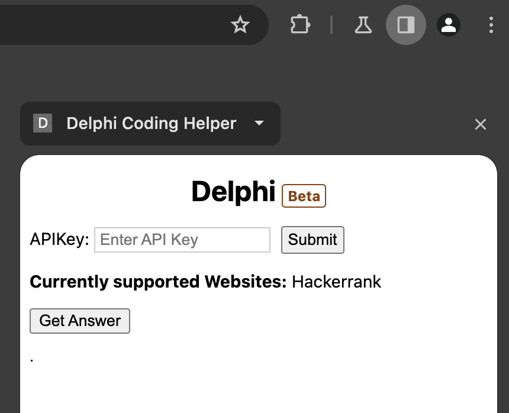
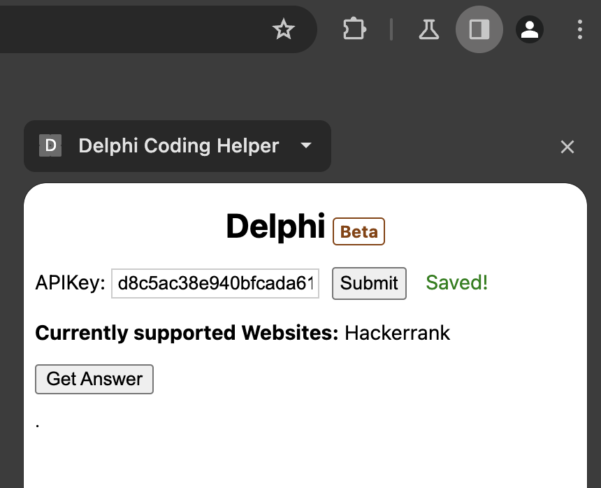
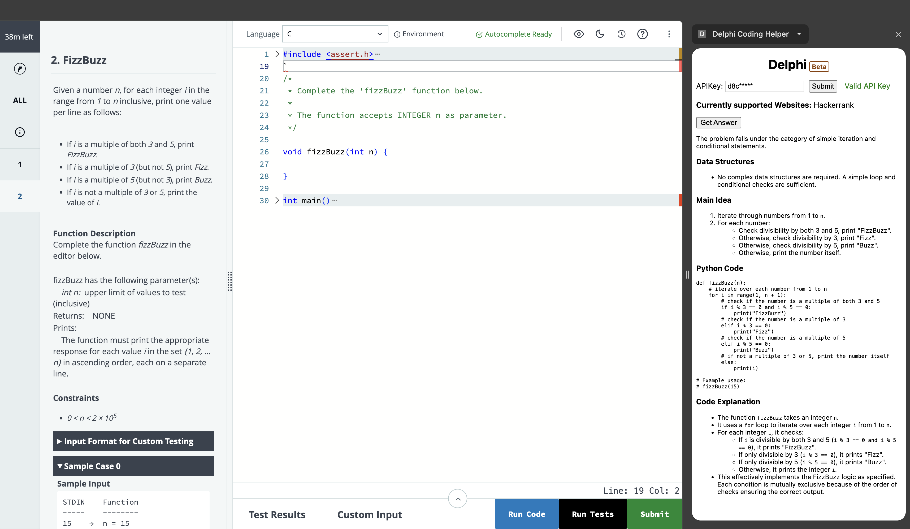

# Delphi

A coding helper extension for coding questions.

## Todo:

- [ ] Add support for:
    - [X] Hackerrank
    - [ ] Coderpad
    - [ ] Codality
- [ ] Convert to fully fledged back and forth chat

## Installation Guide

1. Clone the extension locally
2. Follow [Google's Load Unpacked Extension](https://developer.chrome.com/docs/extensions/get-started/tutorial/hello-world#load-unpacked) guide to install the extension.
3. Open the extension in the sidebar

4. Add the API key and click on the submit button. If the API key is valid it will return with the status `Saved!`.

5. Click Get Answer when you need AI assistance for a given question:

### Updating

You can `git pull` from the main branch to update the extension.